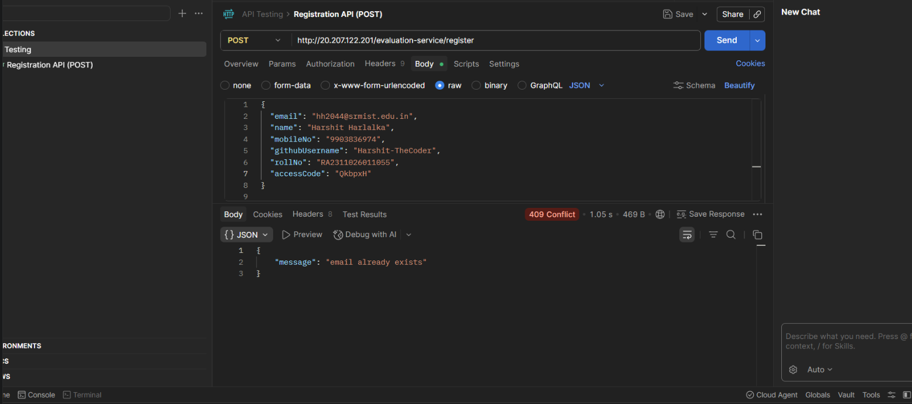
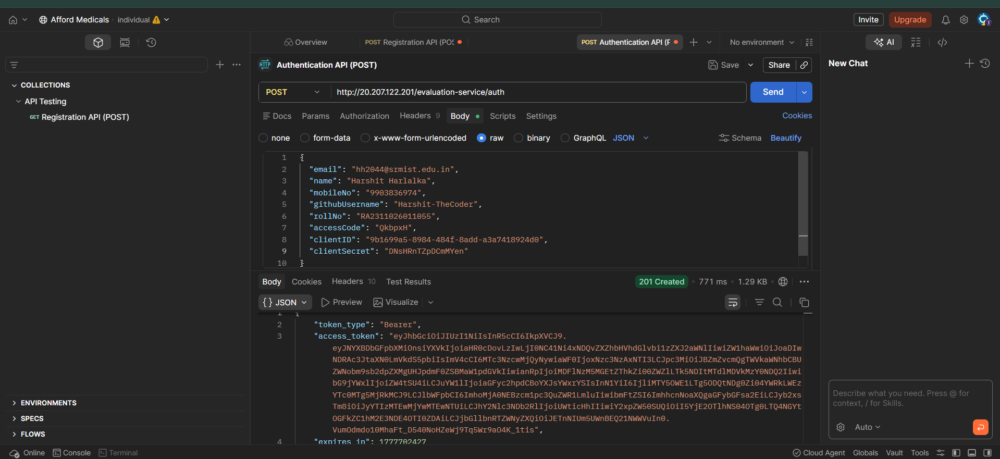
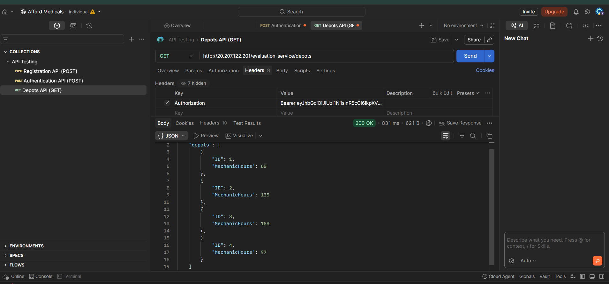
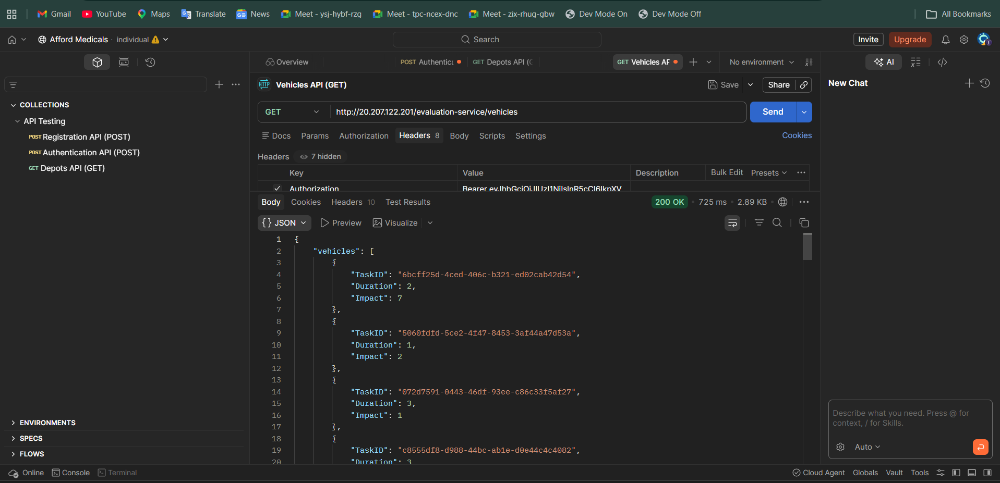
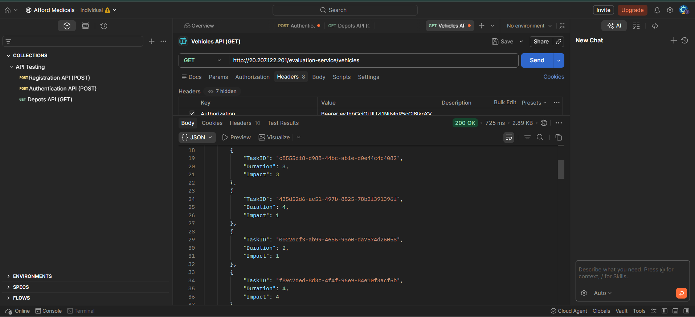
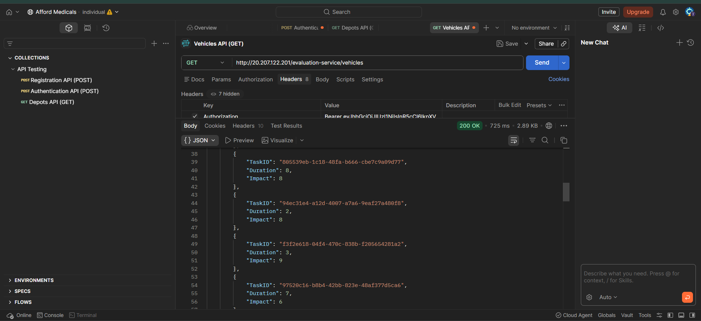
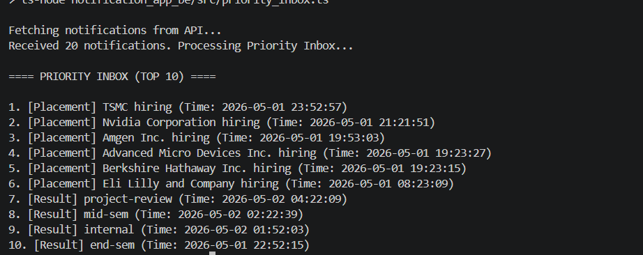
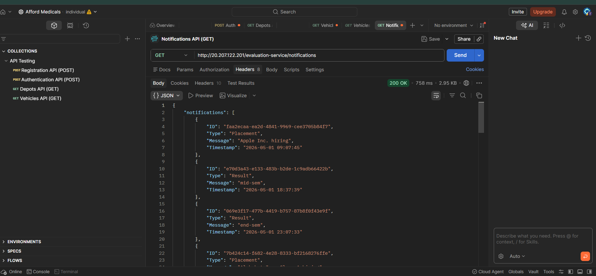

# Afford Medicals Backend

This is the backend project for the Afford Medicals evaluation. It's a Node.js monorepo that handles vehicle maintenance scheduling and campus notifications.

## Problem Statement
The goal is to build a modular backend that integrates a custom logging middleware, a vehicle scheduling algorithm (using 0/1 Knapsack), and a notification service. We need to interact with the evaluation APIs and ensure all logs follow a specific format and are under 48 characters.

## Requirements
- Node.js monorepo setup (npm workspaces)
- Centralized logging middleware that sends logs to the evaluation server with a Bearer token
- DP algorithm to optimize vehicle maintenance based on mechanic hours and impact
- System design for the Campus Notification microservice

## Tech Stack
- Node.js & TypeScript
- Express.js
- node-cron
- axios

## Architecture & Workflow
The project is split into workspaces:
1. **scripts/setup_auth.ts**: Gets the auth token from the evaluation API and saves it locally to `auth.json`.
2. **logging_middleware**: A local package that handles all logs instead of standard console.log.
3. **notification_app_be**: An Express server for notifications. Also contains the Priority Inbox logic.
4. **vehicle_maintence_scheduler**: A cron job that runs every minute.
5. **vehicle_scheduling**: The script that fetches depots/vehicles and runs the knapsack algorithm to maximize impact.

## How to run the project

1. **Install everything**
   ```bash
   npm install
   ```

2. **Setup Auth**
   Make sure your details are in `scripts/setup_auth.ts`, then run:
   ```bash
   npm run setup-auth
   ```

3. **Build the typescript files**
   ```bash
   npm run build
   ```

4. **Start the services**
   You can run these depending on what you want to test:
   - `npm run start:backend`
   - `npm run start:scheduler`
   - `npm run start:scheduling`
   - `npm run start:priority-inbox`

---

## System Design
The answers and architecture plan for the 6 notification stages are in [notification_system_design.md](./notification_system_design.md).

---

## API Screenshots

*(Postman test results for the evaluation APIs)*

### 1. Registration (`/register`)


### 2. Authentication (`/auth`)


### 3. Depots Payload (`/depots`)


### 4. Vehicles Payload (`/vehicles`)




### 5. Priority Inbox Results


### 6. Notification (`/notification`)


